<div align="center">

# Human-in-the-Loop Agenten in der Pflegerobotik: Evaluierung und interaktive Anwendung von OCR und VLMs zur Verarbeitung handschriftlicher Pflegedokumentation. 

**Bashar Alsamar**

Universität zu Lübeck — Bachelor Thesis 2026

[](Thesis/build/Abschlussarbeit.pdf)
[](https://github.com/dein-user/bachelor-thesis-nursing-agents)

Bachelorarbeit zur automatisierten Verarbeitung handschriftlicher Pflegenotizen: Vergleich und Kombination von OCR-Pipelines, Vision-Language-Modellen (VLMs), LLM-Nachverarbeitung und einem agentenbasierten, robotergestützten Workflow.

Dieses Repository enthält den vollständigen Code, die synthetischen Datensätze, die Experimente sowie die LaTeX-Quelle der Arbeit selbst.

## Inhaltsverzeichnis

1. [Introduction](#1-introduction)
   1.1 [Motivation](#11-motivation)
   1.2 [Related Work](#12-related-work)
   1.3 [Key Concepts and Terminology](#13-key-concepts-and-terminology)
2. [Materials and Methods](#2-materials-and-methods)
   2.1 [Experimental Setup](#21-experimental-setup)
   2.2 [Datasets](#22-datasets)
   2.3 [Extraction Pipeline Architectures](#23-extraction-pipeline-architectures)
   2.4 [Model Selection and Baselines](#24-model-selection-and-baselines)
   2.5 [Edge-AI Frame Selection (Vision Routing Agent)](#25-edge-ai-frame-selection-vision-routing-agent)
   2.6 [Human-in-the-Loop and Agentic Workflow](#26-human-in-the-loop-and-agentic-workflow)
   2.7 [Metrics for Evaluation](#27-metrics-for-evaluation)
3. [Experiments and Results](#3-experiments-and-results)
   3.1 [Frame Selection Performance and Latency Optimization](#31-frame-selection-performance-and-latency-optimization)
   3.2 [Task 1: Transcription Performance](#32-task-1-transcription-performance-image-to-text)
   3.3 [Task 2: Downstream Understanding and Extraction](#33-task-2-downstream-understanding-and-extraction)
4. [Discussion](#4-discussion)
5. [Conclusions](#5-conclusions)
6. [Repository-Struktur und Nutzung](#6-repository-struktur-und-nutzung)

---

## 1. Introduction

### 1.1 Motivation

Handschriftliche Pflegedokumentation ist in vielen klinischen und pflegerischen Kontexten nach wie vor Alltag, erschwert jedoch die digitale Weiterverarbeitung, Auswertung und Übergabe von Informationen. Gleichzeitig eröffnen moderne Vision-Language-Modelle die Möglichkeit, handschriftlichen Text nicht nur zu transkribieren, sondern direkt semantisch zu verstehen und zu strukturieren – potenziell ganz ohne dediziertes OCR.

Ein zentrales Hindernis für Forschung in diesem Bereich ist der Mangel an frei verfügbaren, DSGVO-konformen Datensätzen mit echten Pflegenotizen. Diese Arbeit begegnet dem Problem mit einem synthetischen, aber hochrealistischen Datensatz und untersucht, wie ein solches System – von der Bildaufnahme über die Texterkennung bis zur strukturierten Extraktion – in einem realen Robotik-Szenario (Pepper-Roboter) eingesetzt werden kann.

### 1.2 Related Work

Die Arbeit ordnet sich in zwei Forschungslinien ein:

- **LLMs zur OCR-Nachkorrektur:** klassische OCR-Engines liefern Rohtext, der anschließend durch ein Sprachmodell bereinigt, korrigiert und strukturiert wird.
- **VLMs zum direkten klinischen Dokumentenverständnis:** end-to-end multimodale Modelle verarbeiten das Bild direkt, ohne zwischengeschaltete Texterkennung.

Der Beitrag dieser Arbeit besteht in der systematischen, direkten Gegenüberstellung beider Ansätze auf identischen Daten sowie in der Integration des besten Ansatzes in eine vollständige, latenzoptimierte Agentenarchitektur für den praktischen Robotereinsatz.

### 1.3 Key Concepts and Terminology

Kurzer Überblick über die verwendeten Kerntechnologien:

- **Optical Character Recognition (OCR):** klassische Texterkennung aus Bilddaten (u. a. EasyOCR, Surya, LightOnOCR).
- **Large Language Models (LLMs):** sprachbasierte Modelle zur Nachverarbeitung, Zusammenfassung und strukturierten Extraktion von OCR-Ausgaben.
- **Vision Language Models (VLMs):** multimodale Modelle, die Bild und Text gemeinsam verarbeiten und so OCR und Sprachverständnis in einem Schritt vereinen können (u. a. Qwen3-VL, Pixtral).

---

## 2. Materials and Methods

### 2.1 Experimental Setup

Alle Experimente basieren auf demselben synthetischen Datenkorpus, um Text-Extraktion (Task 1) und nachgelagertes Verständnis/Extraktion (Task 2) fair und reproduzierbar über alle Modellklassen hinweg vergleichen zu können.

### 2.2 Datasets

**Datengrundlage: Synthetischer Datensatz**

- **Motivation:** Mangel an frei verfügbaren Daten und strenge DSGVO-Auflagen erfordern einen synthetischen, aber hochrealistischen Datensatz.
- **Schriftarten-Validierung:** Programmatische Analyse mit `fonttools`; nur 24 von 35 Fonts unterstützen den deutschen medizinischen Zeichensatz (`ä`, `ö`, `ü`, `ß`) fehlerfrei.
- **Textkorpus und Metadaten:** 50 einzigartige klinische Szenarien (JSON) mit realistischer Demografie und Pflege-Terminologie (z. B. RR, BZ).
- **Implementierung der Datengenerierung:** Modulares Python-Framework auf Basis von Pillow (PIL), das textbasierte Szenarien und validierte Schriftarten vollautomatisch in annotierte, realistische Bilddaten überführt.

**Datenstratifizierung**

| Pflegegrad | Umfang | Beschreibung |
|---|---|---|
| 1 (gering) | ca. 200–350 Zeichen | Kurze, routinemäßige Notizen |
| 2–3 (mittel) | ca. 400–800 Zeichen | Standarddokumentation |
| 4–5 (hoch) | bis zu 2.500+ Zeichen | Komplexe Berichte (z. B. Palliativ) |

**Visuelle Synthese, Variabilität und Papiersimulation**

- **Dynamisches Layout:** DIN A5 für kurze und A4 für lange Texte, inklusive Lineaturen (liniert, kariert) sowie variierenden Papierfarben.
- **Simulation realer Schreibprozesse:**
  - Modus „Gestresst": hastig, größere Schrift, starke Neigung, eng.
  - Modus „Sorgfältig": sauber ausgerichtet, kleiner, gerader.
- **Tintensimulation:** Alpha-Blending für ungleichmäßigen Tintenfluss.

**Synthetische Beispielbilder**

Unterschiedliche Schreibmodi, Layouts und Tintenverläufe aus dem synthetischen N30-Datensatz:

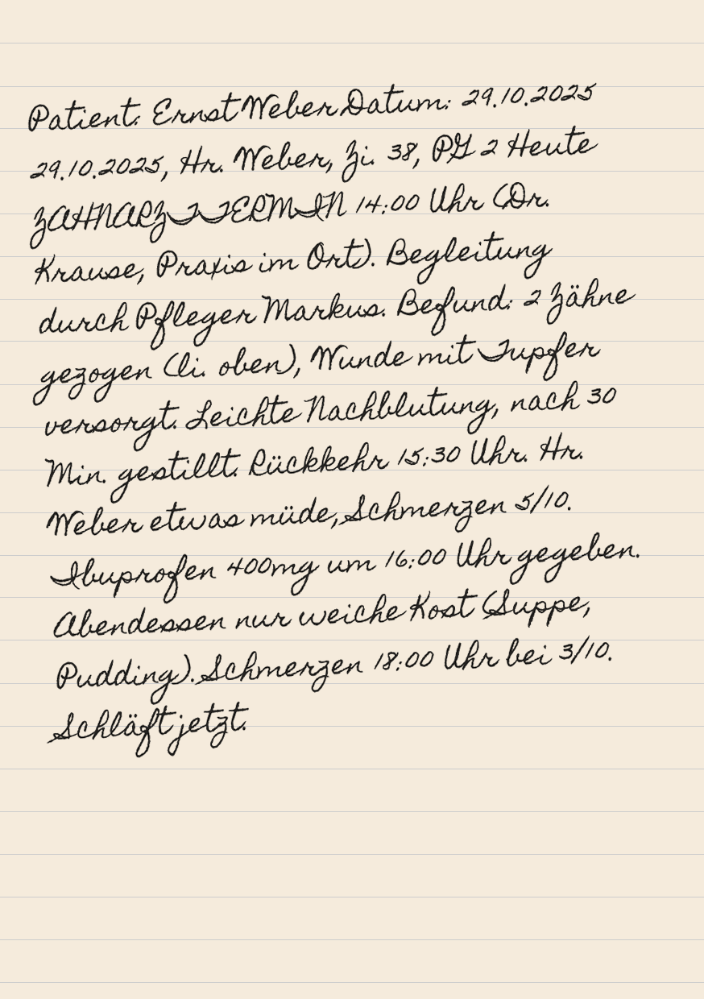
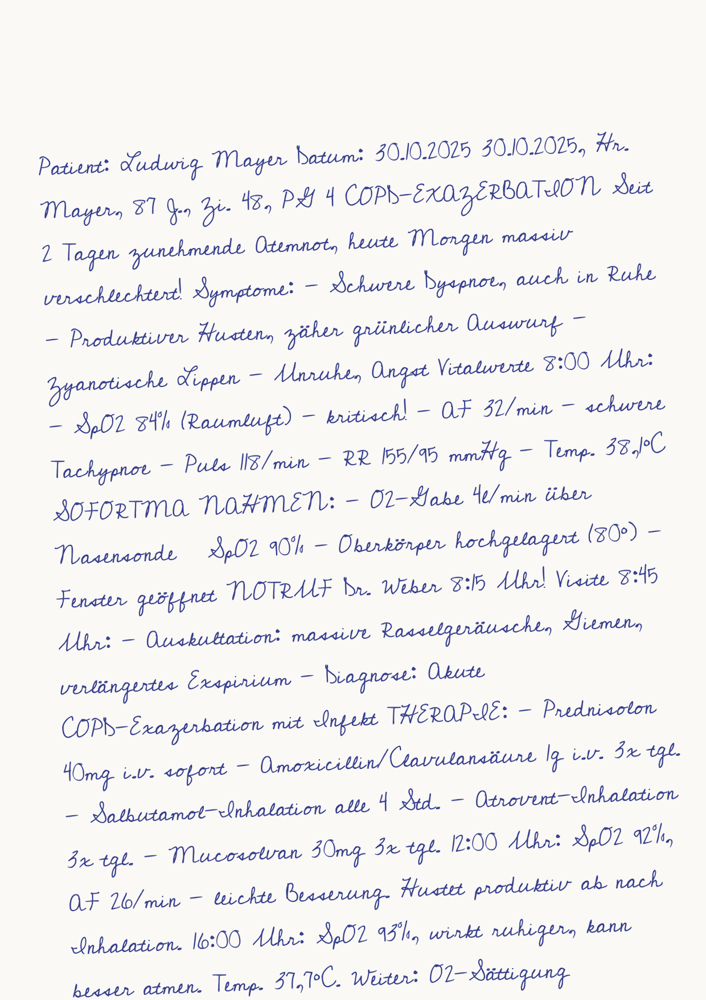
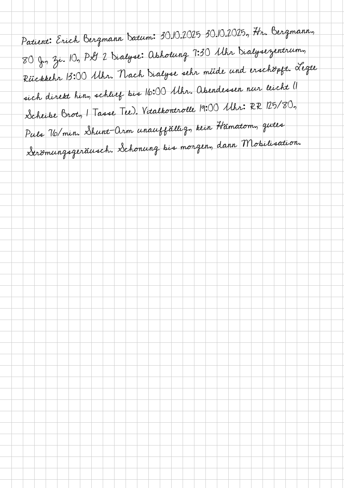
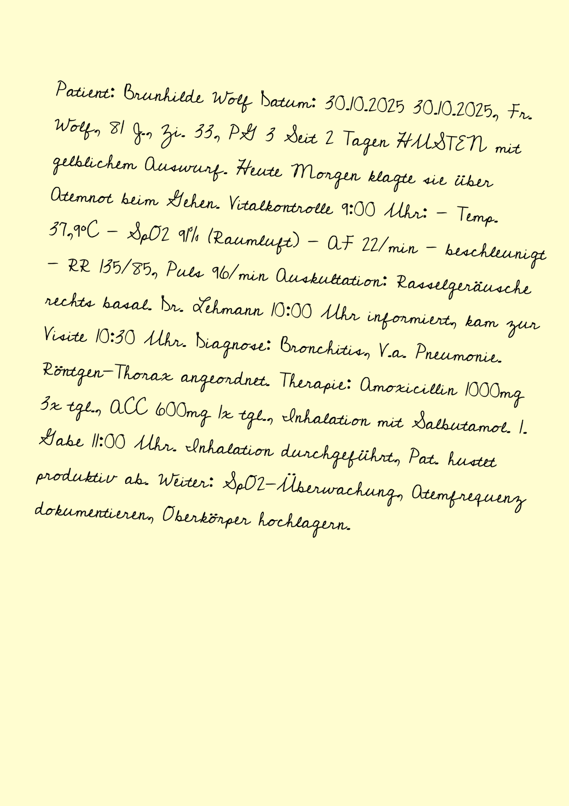
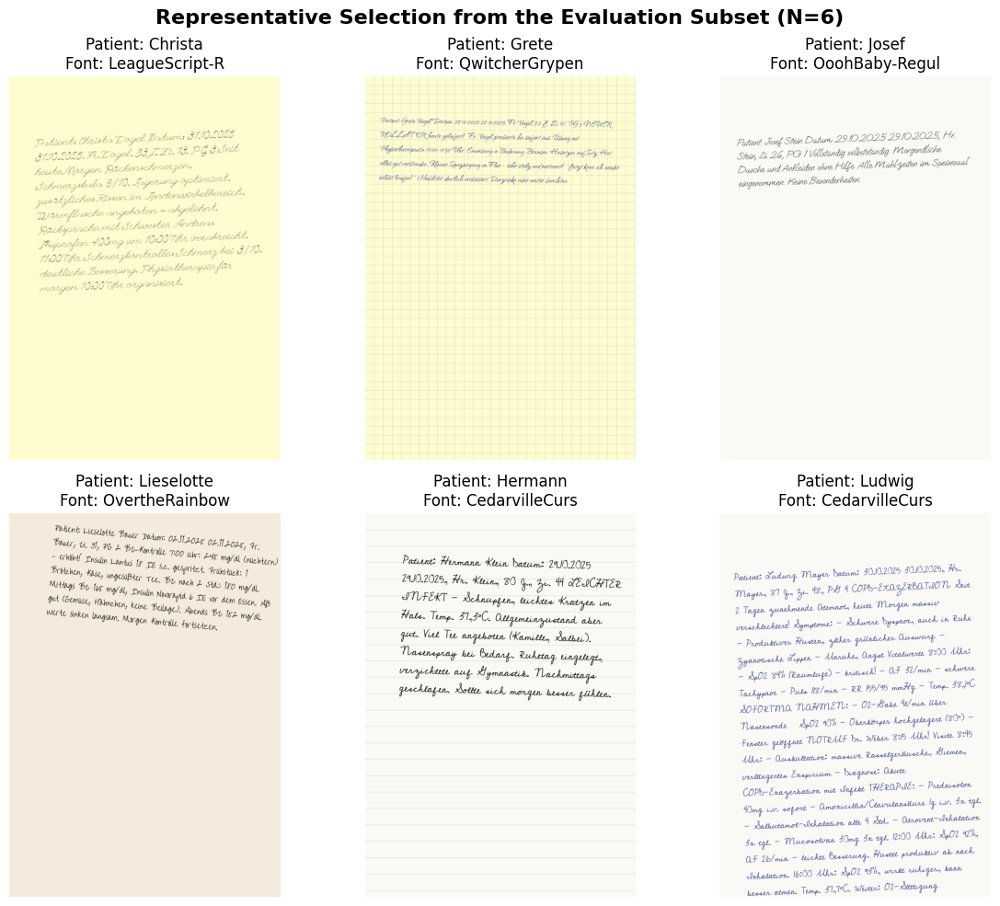
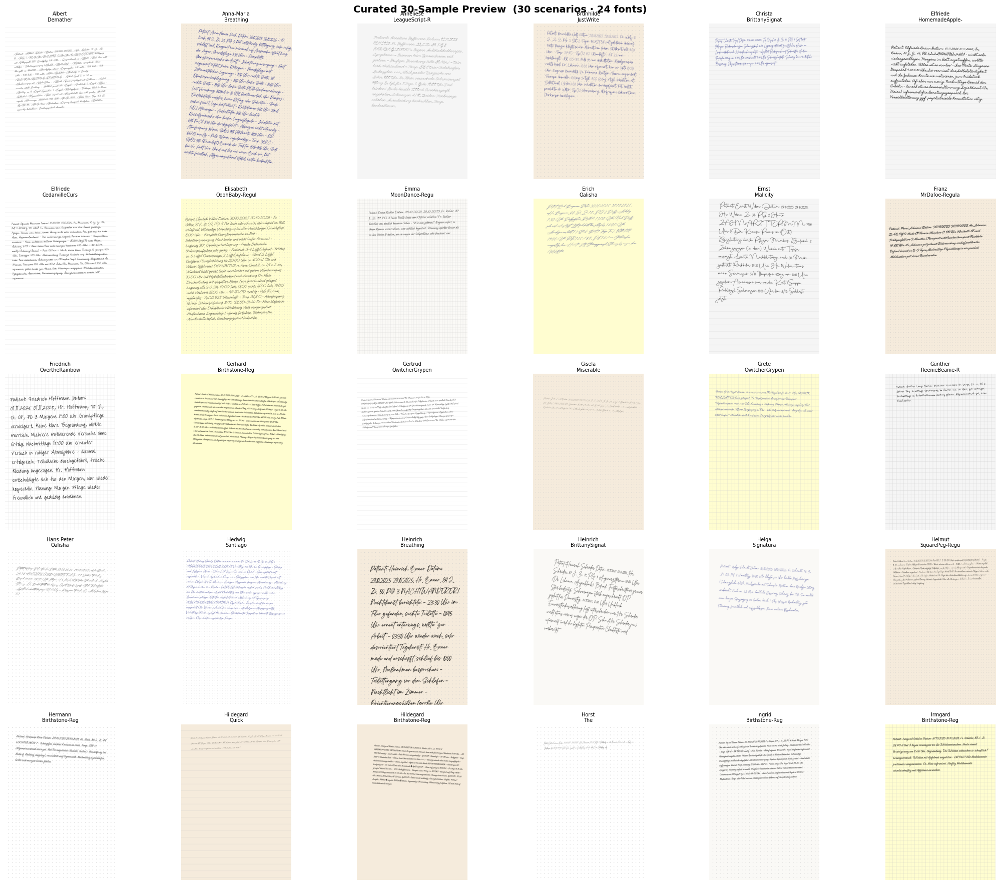

**Datenverteilungen**

Die vier Verteilungsplots dokumentieren die kontrollierte Zusammensetzung des Testsets (`test_set_559`) und belegen die Stratifizierung über Layout-, Stil- und Pflegekontext-Merkmale.

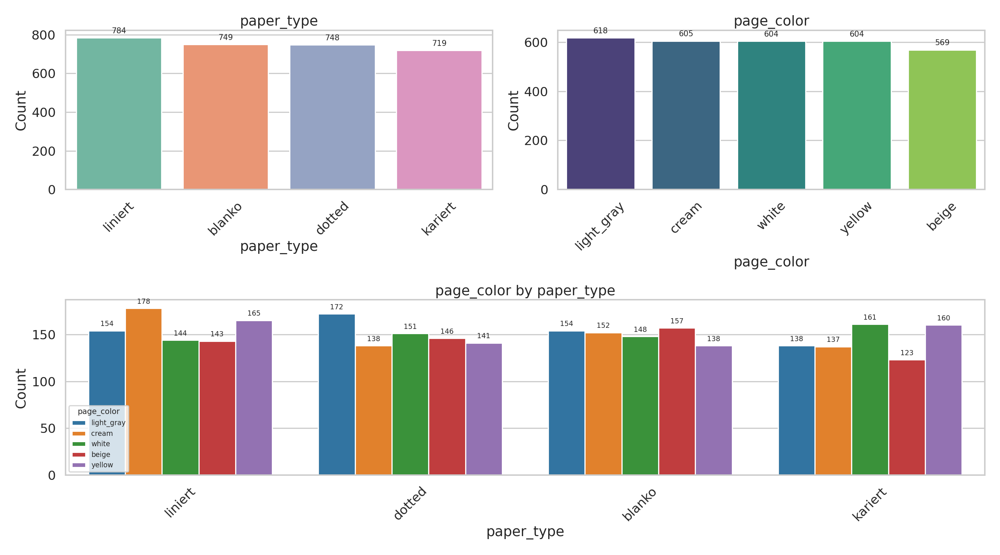
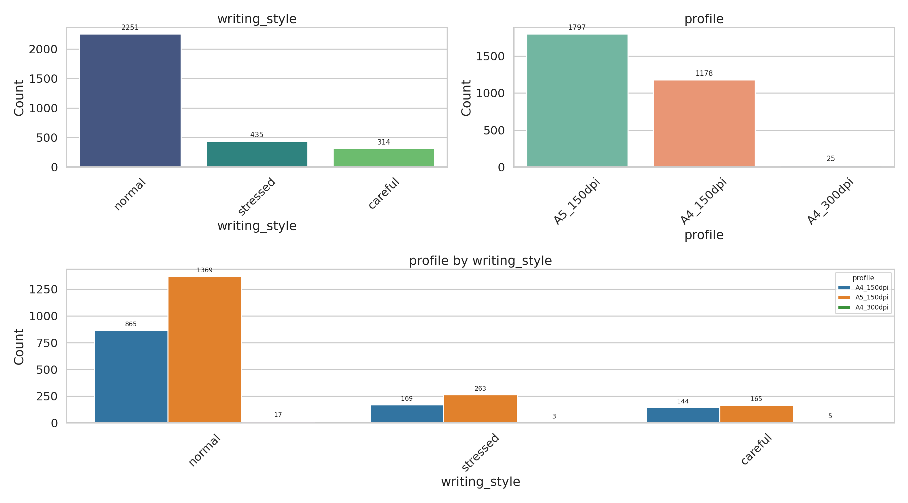
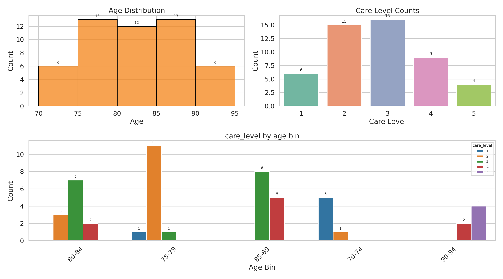
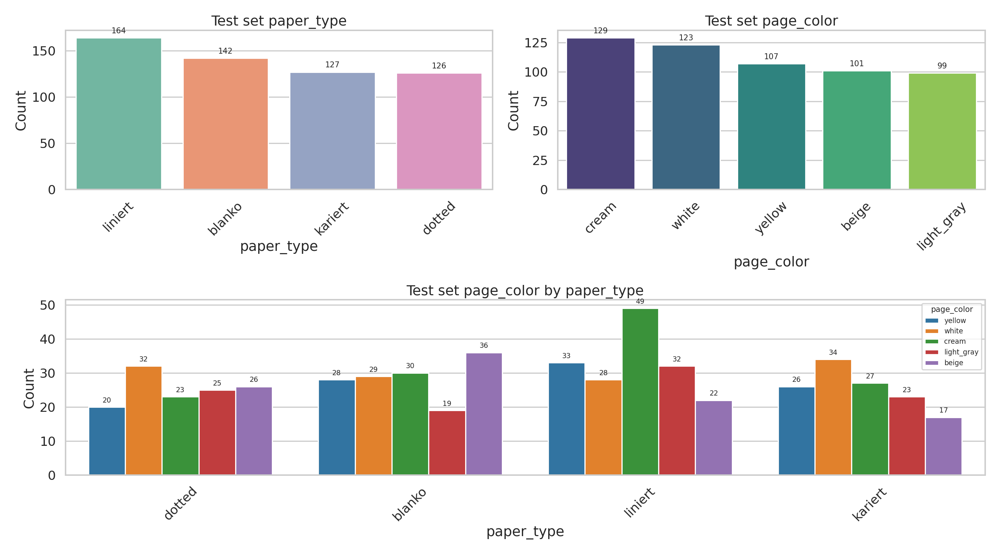

### 2.3 Extraction Pipeline Architectures

Zwei grundsätzlich unterschiedliche Architekturen werden gegenübergestellt:

1. **OCR + LLM (kaskadiert):** klassische Texterkennung, gefolgt von LLM-Nachverarbeitung zur Korrektur und Strukturierung.
2. **End-to-End VLM:** ein einzelnes multimodales Modell übernimmt Texterkennung und semantisches Verständnis in einem Schritt.

Die folgende Abbildung zeigt die Pipeline-Architektur des vorgeschalteten Routing-Ansatzes:


### 2.4 Model Selection and Baselines

- **Optical Character Recognition (Die Text-Extraktoren):** EasyOCR, Surya, LightOnOCR.
- **Large Language Models (Die Reasoner):** zur Nachverarbeitung und strukturierten Extraktion der OCR-Ausgaben.
- **Vision Language Models (Die End-to-End-Extraktoren):** u. a. Qwen3-VL und Pixtral.
- **Prompt Engineering und iterative Verfeinerung:** alle Prompt-Vorlagen sind versioniert und über die Pipeline-Skripte auswählbar (siehe [Standalone LLM Pipeline](#standalone-llm-pipeline)).

### 2.5 Edge-AI Frame Selection (Vision Routing Agent)

- **Problem in der Servicerobotik:** Bewegungsunschärfe, wechselndes Licht und unklare Bildausschnitte beeinträchtigen die Erkennung stark.
- **Schwäche klassischer Filter:** mathematische Filter (z. B. Laplace-Varianz) bewerten nur die Schärfe, erfassen jedoch nicht den semantischen Kontext (z. B. scharfer Hintergrund vs. leicht unscharfes, aber lesbares Dokument).
- **Die Lösung:** Kaskadenarchitektur (Small-to-Large) – der eigentlichen Extraktionspipeline wird ein lokaler Vision Routing Agent vorgeschaltet, der nur gültige Bilder durchlässt.

**2.5.1 Lightweight VLM und 4-Bit-Quantisierung**
Ein kompaktes VLM (Qwen3-VL-4B-Instruct) läuft lokal per 4-Bit-Quantisierung. Bilder werden gezielt herunterskaliert, um VRAM-Überläufe zu verhindern.

**2.5.2 Structured Few-Shot Prompting und Routing-Logik**
Das Modell generiert deterministisch eine Punktzahl (0–100) zur Bewertung der Bildqualität.

**2.5.3 Dynamic Frame Sampling und Batching**
Anstatt Einzelbilder sequenziell zu prüfen (zu hohe Latenz für HRI), werden 8 repräsentative Bilder parallel evaluiert. Nur das beste Bild (Score ≥ 70) wird an die großen Modelle (8B/14B) weitergeleitet.

**2.5.4 In-Memory Processing und Datenschutz (DSGVO-Konformität)**
Die Bildverarbeitung erfolgt ausschließlich im Arbeitsspeicher, ohne dauerhafte Speicherung sensibler Rohdaten – zentral für den Einsatz im klinischen Umfeld.

### 2.6 Human-in-the-Loop and Agentic Workflow

**2.6.1 Agentic System Architecture**

Ziel ist kollaborative Assistenz statt einer starren Pipeline: menschliche Expertise wird gezielt bei Unsicherheiten eingebunden.

**2.6.2 Human-in-the-Loop Design**

Drei Workflow-Status:

- **Status-Updates (Latenz-Überbrückung):** Der Nutzer wird stets informiert, was das System gerade tut (z. B. „Ich habe das beste Bild gefunden" oder „Ich erstelle nun die Zusammenfassung").
- **Interaktive Klärung (Ask Human):** Bei Unsicherheit (z. B. unleserliche Schrift) pausiert der Agent. Der Roboter stellt eine gezielte Rückfrage (z. B. „Ist das zweite Medikament Novamin?"). Die gesprochene Antwort löst das Problem.
- **Autonome Extraktion (Success):** Bei klarer Lesbarkeit wird die Struktur direkt generiert und der erfolgreiche Speicherabschluss verbal bestätigt.

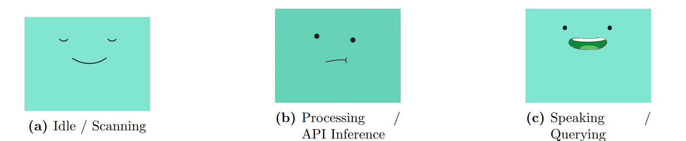

**Human-Robot Interaction (HRI) Interface**

- **Personalisiertes Audio:** Qwen-TTS-Base-1.7 erzeugt eine konsistente, geklonte Stimme für die dynamische „Ask Human"-Interaktion.
- **Visuelles Feedback:** Ein animiertes, minimalistisches digitales Gesicht spiegelt den Systemstatus wider (Zuhören, Denken, Sprechen), um die Akzeptanz des Klinikpersonals zu erhöhen. Während des Scannens zeigt es einen neutralen, konzentrierten Ausdruck, während der API-Inferenz eine nachdenkliche Animation und bei einer Rückfrage an die Pflegekraft einen offenen, sprechenden Ausdruck. Diese visuelle Anthropomorphisierung liefert unmittelbares, nonverbales Feedback zum Systemstatus und macht die Interaktion für das klinische Personal natürlicher und zugänglicher.

**Systemintegration**

Das Modell mit der besten Gesamtleistung (Pixtral-8B via API) wurde in eine Python-basierte Proof-of-Concept-Software integriert. Die Demonstration erfolgte auf einem lokalen Rechnersystem unter Verwendung von Windows Subsystem for Linux (WSL). Da WSL keinen direkten Hardwarezugriff auf USB-Peripheriegeräte wie Webcams bietet, wurde ein spezieller Python-Bridge-Server auf dem Windows-11-Host implementiert, der den Hardware-Videostream erfasst und die Einzelbilder an die WSL-Umgebung weiterleitet – für eine nahtlose Verbindung zwischen physischen Sensoren und der Linux-basierten KI-Pipeline.

Zur Optimierung der Systemlatenz werden wiederkehrende Statusmeldungen (z. B. „Ich starte die Aufnahme") vorab generiert und lokal zwischengespeichert. Dieser hybride Audio-Ansatz gewährleistet sofortige akustische Rückmeldung bei Standard-Zustandswechseln, während die rechenintensive dynamische TTS-Generierung ausschließlich für unvorhersehbare Rückfragen an den Menschen reserviert bleibt.

### 2.7 Metrics for Evaluation

**2.7.1 Task 1: Transcription Performance**

Vergleich der Transkriptionshypothese (H) mit der Referenz (R) nach Normalisierung (z. B. Kleinschreibung, Entfernung von Zeilenumbrüchen). Verwendete Metriken:

- Character Error Rate (CER) und Word Error Rate (WER)
- Normalized Edit Distance (NED)
- Vocabulary Overlap (Unique-Word Precision / Recall / F1)

**2.7.2 Task 2: Downstream Understanding (Summarization and Extraction)**

Bewertung der Bewahrung klinisch relevanter Informationen bei Textausgaben (Zusammenfassungen) und strukturierter Feldextraktion (JSON). Verwendete Metriken:

- ROUGE-Scores (ROUGE-1, ROUGE-2, ROUGE-L) für Zusammenfassungen
- Medical Term Preservation (Keyword-Set Precision / Recall / F1)
- BERTScore (semantische Ähnlichkeit)

---

## 3. Experiments and Results

### 3.1 Frame Selection Performance and Latency Optimization

Die folgende Abbildung zeigt die Frame-Bewertung und Auswahl des Routing-Agenten:

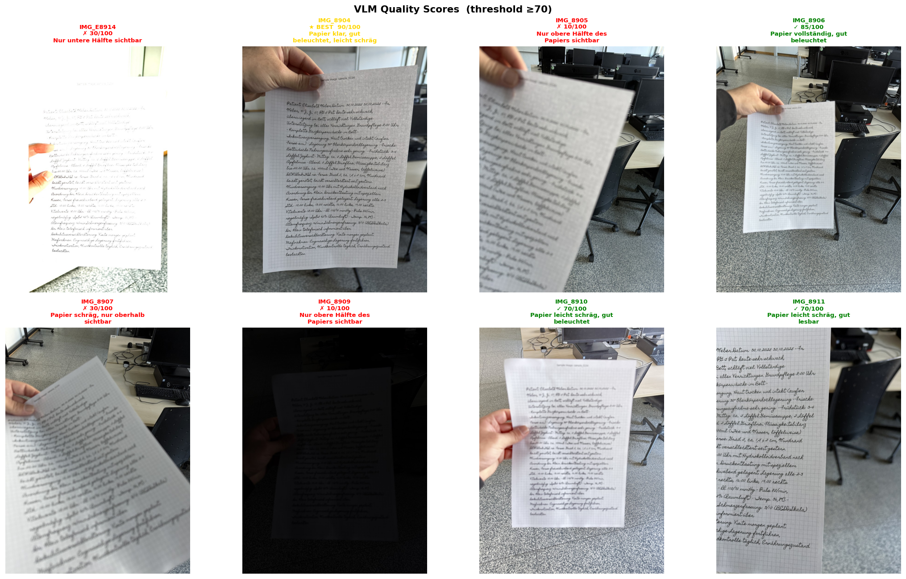

**Performance und Latenz (Die Praxis-Hürde)**

- **Kaltstart (Initial Run):** ca. 3 Minuten. Der Flaschenhals ist die lokale Text-to-Speech-Generierung (TTS) auf der RTX 3060 (ca. 2:22 Min).
- **Die Extraktion (effizient):** Frame-Selection (ca. 10 Sek) und Pixtral-API (ca. 2–5 Sek) arbeiten sehr schnell.
- **Lösung:** Audio-Caching für Standard-Antworten und kontinuierliche Status-Updates überbrücken Wartezeiten.

**Robustheit im echten Umfeld (LG Webcam)**

- **Lichtabhängigkeit:** Bei schwachem Licht greift der Vision-Router sicher ein (Score fällt unter 70, Human-in-the-Loop wird getriggert).
- **Erfolgsrate:** Bei adäquater Beleuchtung wurden neue, authentische Notizen zu 100 % korrekt extrahiert.

### 3.2 Task 1: Transcription Performance (Image-to-Text)

**Evaluation der OCR-Modelle**

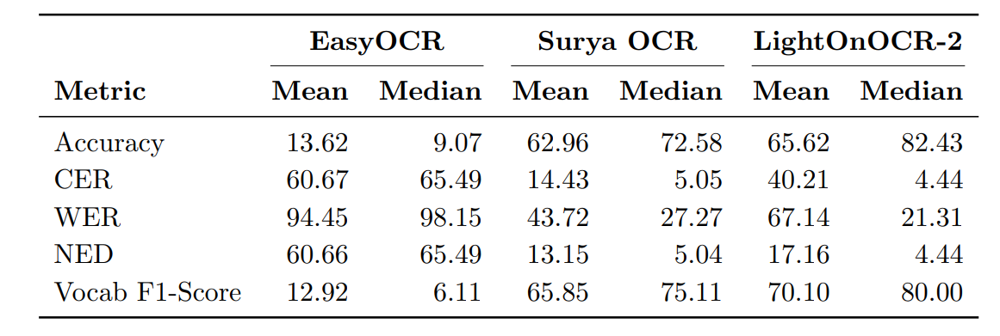

**Evaluation der End-to-End-VLMs**

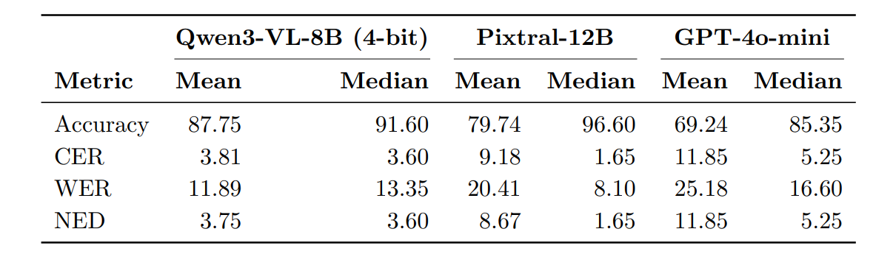

Vergleich aller Text-Extraktoren und Überleitung zu Task 2: die Ergebnisse aus Task 1 bilden die Grundlage für die nachgelagerte Bewertung des Verständnisses und der Extraktion in Task 2.

### 3.3 Task 2: Downstream Understanding and Extraction

**Ansatz 1: OCR + LLM Pipelines**

- **Datenbasis:** das exakt balancierte N=48-Subset.
- **Herausforderung:** LLMs müssen mit den fehlerhaften, halluzinierten oder fragmentierten Texten der OCR-Engines aus Task 1 arbeiten.
- **Umfang:** alle 3 OCR-Modelle wurden kreuzweise mit allen 3 LLMs getestet.

**Ansatz 2: End-to-End Vision-Language Models (VLMs)**

- **Datenbasis:** dasselbe N=48-Subset (für faire Vergleichbarkeit).
- **Herausforderung:** multimodale Modelle verarbeiten das Bild direkt, ohne vorherige OCR-Transkription.
- **Bewertung:** Fokus auf lexikalische Ähnlichkeit (ROUGE), semantische Äquivalenz (BERTScore) und domänenspezifische Genauigkeit.

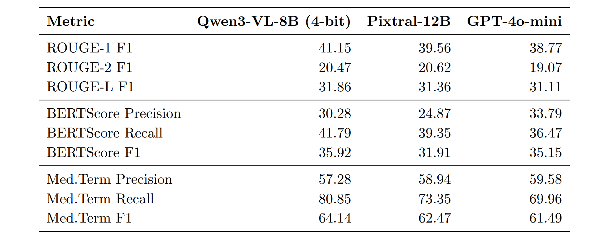
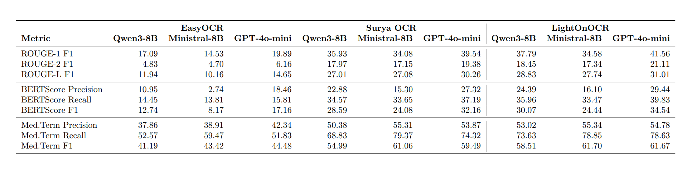

**Proof-of-Concept & Demo**

Systemintegration und interaktiver Proof-of-Concept:

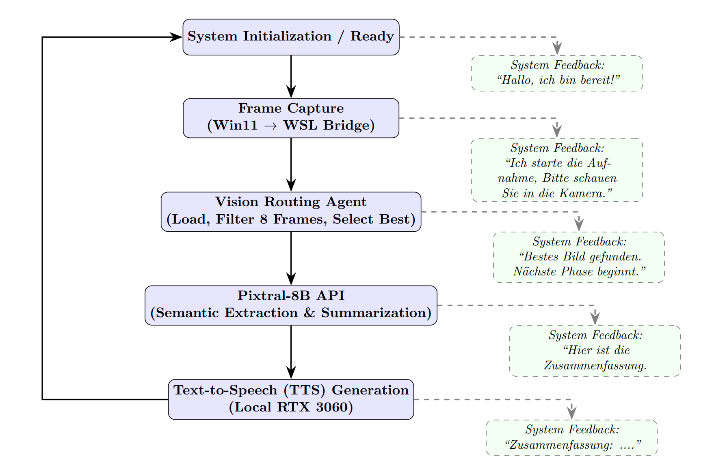

---

## 4. Discussion

**4.1 RQ1 & RQ2 – Der architektonische Wandel von kaskadierten Pipelines zu VLMs**
Die Ergebnisse zeigen, unter welchen Bedingungen end-to-end VLMs gegenüber klassischen OCR+LLM-Kaskaden Vorteile bieten und wo kaskadierte Ansätze weiterhin robuster sind.

**4.2 RQ3 – Zuverlässigkeit, Halluzinationen und Extraktionskonsistenz**
Diskussion der beobachteten Fehlermodi, insbesondere Halluzinationen bei End-to-End-Modellen und Fehlerfortpflanzung in kaskadierten Pipelines.

*4.2.1 Deployment-Constraints: Datenschutz vor Spitzenleistung* — Für den produktiven Einsatz im Pflegekontext wiegt DSGVO-konforme, lokale In-Memory-Verarbeitung schwerer als marginale Performance-Gewinne größerer, cloud-basierter Modelle.

**4.3 Limitations and Future Work**
Grenzen der aktuellen Arbeit (u. a. synthetischer Datensatz, begrenzte Modellauswahl, Hardware-Constraints) sowie mögliche Erweiterungen für zukünftige Arbeiten.

## 5. Conclusions

Diese Arbeit zeigt, dass ein lokal vorgeschalteter Vision Routing Agent in Kombination mit einem leistungsfähigen End-to-End-VLM (Pixtral-8B) eine praxistaugliche, DSGVO-konforme Lösung für die automatisierte Verarbeitung handschriftlicher Pflegenotizen im Robotik-Kontext darstellt. Die vollständige Integration in einen Human-in-the-Loop-Workflow mit Pepper-Roboter belegt die praktische Anwendbarkeit über die reine Modellevaluation hinaus.

---

## 6. Repository-Struktur und Nutzung

### Repository-Struktur

```text
bachelor-thesis-nursing-agents/
├── README.md
├── requirements.txt
├── library_versions.json
├── assets/
│   └── readme/
├── configs/                     # aktuell leer / als Ablage fuer Konfiguration vorgesehen
├── data/
│   ├── raw/
│   ├── processed/
│   ├── synthetic/
│   ├── N30/
│   └── test_set_*.json/.txt
├── docs/
│   ├── EVALUATION_METRICS_GUIDE.md
│   ├── OCR_LLM_PIPELINE_GUIDE.md
│   ├── STANDALONE_LLM_PIPELINE.md
│   └── TEST_SET_SPECIFICATION.md
├── experiments/
│   ├── 00_json_llm_test.ipynb
│   ├── Pixtral/
│   ├── Real_images/
│   ├── chatgpt4o_mini/
│   ├── easyocr_piplines/
│   ├── lightonocr_pipelines/
│   ├── qwen3VL-8B-4Bit/
│   └── surya_pipelines/
├── font_test/
│   ├── check_char_support.py
│   ├── fonts_with_missing_chars.txt
│   └── test_fonts.py
├── notebooks/
│   ├── easyocr_test.ipynb
│   ├── lightonocr_test.ipynb
│   ├── paddleOCR_test.ipynb
│   ├── PP_OCRV5.ipynb
│   ├── qwen3VL_8B_4bit.ipynb
│   ├── qwen3VL_8B_4bit_2steps.ipynb
│   ├── qwen3VL_8B_4bit_2steps_backup.ipynb
│   └── Surya OCR.ipynb
├── results/
│   ├── metrics/
│   │   ├── README.md
│   │   ├── easyocr/
│   │   ├── lightonocr/
│   │   ├── paddleocr/
│   │   └── surya/
│   └── visualizations/
├── scripts/
│   ├── add_reference_summaries.py
│   ├── create_test_set.py
│   ├── evaluate_llm.py
│   ├── evaluate_with_deepeval.py
│   └── run_llm_pipeline.py
├── sounds/
├── chatbot/
│   ├── camera.py
│   ├── gui.py
│   ├── opencv_pygame_viewer.py
│   ├── pixtral_8b_vision_task2.py
│   ├── string_test.py
│   ├── agent_inspector_output/
│   ├── images/
│   ├── saved_frames/
│   └── sounds/
├── src/
│   ├── agents/
│   │   ├── create_voice.py
│   │   └── vision_routing_agent.py
│   ├── data_generation/
│   │   ├── config.py
│   │   ├── utils.py
│   │   └── generate_synthetic_notes.py
│   ├── data_visualization/
│   │   └── visualize_synthetic_data.py
│   ├── evaluation/
│   │   ├── metrics.py
│   │   ├── llm_metrics.py
│   │   └── deepeval_metrics.py
│   ├── llm_processing/
│   │   ├── __init__.py
│   │   ├── llm_pipeline.py
│   │   ├── models.py
│   │   └── prompts.py
│   └── utils/
│       ├── fix_images.py
│       └── image_augmentation.py
└── Thesis/
    ├── Abschlussarbeit.tex
    ├── chapters/
    ├── images/
    ├── otherincludes/
    └── build/
```

### Hauptbausteine

**OCR- und Evaluierungs-Pipeline**

Die OCR-Ergebnisse liegen je nach Verfahren unter `results/metrics/<ocr-method>/` und enthalten typischerweise:

- `summary.csv`
- `summary.json`
- `detailed_results.json`
- `individual/`

Das Evaluierungsmodul in [src/evaluation/metrics.py](src/evaluation/metrics.py) berechnet u. a. CER, WER, NED, Accuracy, Precision, Recall und F1. Die LLM-spezifischen Metriken in [src/evaluation/llm_metrics.py](src/evaluation/llm_metrics.py) decken ROUGE, BLEU, BERTScore, medizinische Term-Erhaltung, JSON-Validierung und Feldgenauigkeit ab.

**Standalone LLM Pipeline**

Die LLM-Nachverarbeitung ist als wiederverwendbares Modul in [src/llm_processing](src/llm_processing) implementiert. Der Einstieg erfolgt meist über [scripts/run_llm_pipeline.py](scripts/run_llm_pipeline.py), die Auswertung über [scripts/evaluate_llm.py](scripts/evaluate_llm.py).

Verfügbare Prompt-Typen werden über `--list-prompts` ausgegeben. Aktuell sind unter anderem diese Vorlagen vorhanden:

- `nursing_summary`
- `critical_info_extraction`
- `care_plan_generation`
- `risk_assessment`
- `simple_summary`
- `VLM_prompt`
- `VLM_prompt_v2`

**Vision Routing Agent**

Der Bild-/Frame-Auswahlagent in [src/agents/vision_routing_agent.py](src/agents/vision_routing_agent.py) bewertet Bildqualität, wählt das beste Frame für die OCR aus und speichert Ergebnisse und Plots unter `data/processed/vision_routing_agent/`.

**Synthetische Datengenerierung**

Die Generierung synthetischer Pflegenotizen liegt in [src/data_generation/generate_synthetic_notes.py](src/data_generation/generate_synthetic_notes.py). Die Konfiguration befindet sich in [src/data_generation/config.py](src/data_generation/config.py), Hilfsfunktionen in [src/data_generation/utils.py](src/data_generation/utils.py).

Standardausgaben sind:

- Bilder: `data/synthetic/output/images/`
- Labels: `data/synthetic/output/labels/`

**Thesis-Quelle**

Die Bachelorarbeit selbst liegt unter `Thesis/` und wird aus `Thesis/Abschlussarbeit.tex` gebaut. Die Kapitel liegen in `Thesis/chapters/`, Zusatzdateien in `Thesis/otherincludes/`.

### Installation

Voraussetzungen:

- Python 3.10 oder neuer
- Optional: NVIDIA-GPU für schnellere Modellinferenz

Empfohlene Einrichtung:

```bash
python3 -m venv .venv
source .venv/bin/activate
pip install -r requirements.txt
```

Falls du die README aus einer frischen Umgebung nutzt, prüfe bei OCR- und LLM-Workflows zusätzlich die Hinweise in der Dokumentation unter [docs/](docs).

### Typische Arbeitsabläufe

**1. LLM-Pipeline auf OCR-Ergebnissen ausführen**

```bash
python scripts/run_llm_pipeline.py \
    --ocr-method easyocr \
    --model qwen-7b
```

Nur die Modelle anzeigen:

```bash
python scripts/run_llm_pipeline.py --list-models
```

Nur die Prompt-Vorlagen anzeigen:

```bash
python scripts/run_llm_pipeline.py --list-prompts
```

**2. LLM-Ergebnisse evaluieren**

```bash
python scripts/evaluate_llm.py \
    --input results/metrics/easyocr/llm_outputs/<experiment>/all_llm_results.json
```

**3. Synthetische Notizen erzeugen**

```bash
python -m src.data_generation.generate_synthetic_notes --num-samples 10 --workers 1 --seed 42
python -m src.data_generation.generate_synthetic_notes --num-samples 500 --workers 8 --seed 42
```

**4. Vision Routing Agent starten**

```bash
python src/agents/vision_routing_agent.py --frames-dir data/synthetic/output/robot_frames
```

**5. Notebooks verwenden**

Die OCR- und VLM-Experimente sind in [notebooks/](notebooks) abgelegt. Typische Startpunkte:

- `notebooks/easyocr_test.ipynb`
- `notebooks/paddleOCR_test.ipynb`
- `notebooks/Surya OCR.ipynb`
- `notebooks/vision_agent.ipynb`

### Ergebnisstruktur

Die wichtigsten erzeugten Artefakte:

- OCR-Ergebnisse: `results/metrics/<ocr-method>/`
- LLM-Outputs: `results/metrics/<ocr-method>/llm_outputs/<model>_<prompt>/`
- OCR-Analyseplots: `results/visualizations/`
- Vision-Routing-Outputs: `data/processed/vision_routing_agent/`
- Synthetische Notizen: `data/synthetic/output/`

### Hinweise

- Der Ordner `configs/` ist derzeit leer und dient als Platz für spätere Konfigurationen.
- `results/`, `data/processed/` und Teile von `chatbot/` enthalten generierte Artefakte und werden je nach Workflow neu erzeugt.
- Modellnamen, Prompt-Listen und Output-Pfade werden direkt von `scripts/run_llm_pipeline.py` und `src/llm_processing/models.py` bestimmt.

---

## Kurz gesagt

Das Repository ist kein reines OCR-Projekt, sondern eine kombinierte Arbeitsumgebung für:

- OCR-Evaluierung
- LLM-Nachbearbeitung
- Vision-basierte Bildauswahl
- Synthetische Datenerzeugung
- Thesis-Schreibprozess in LaTeX
